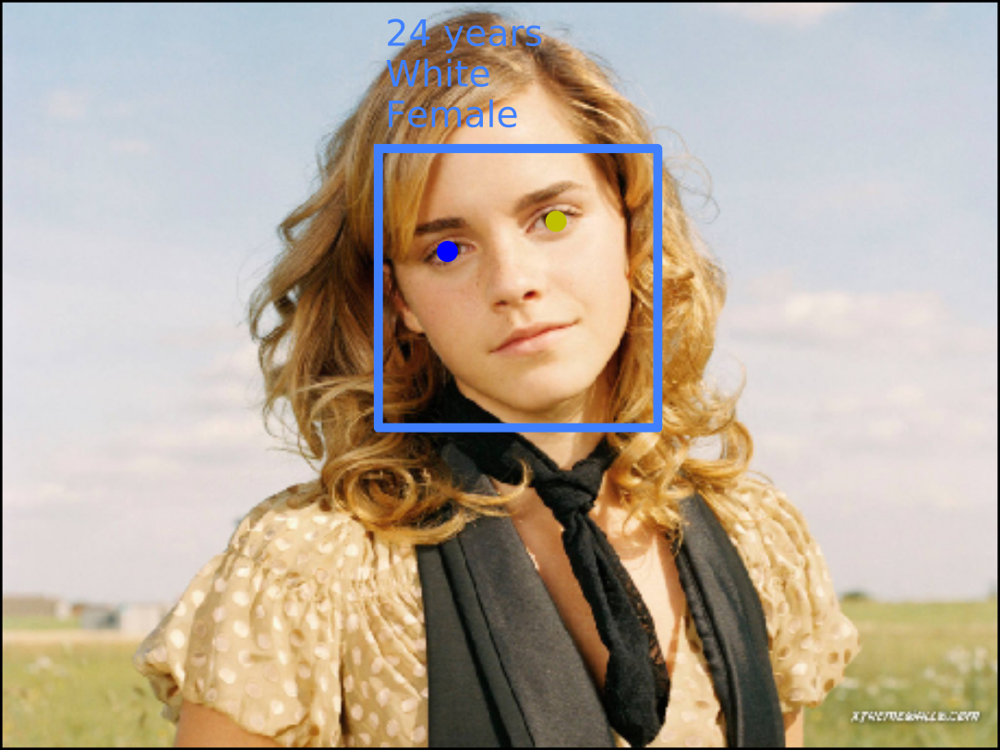
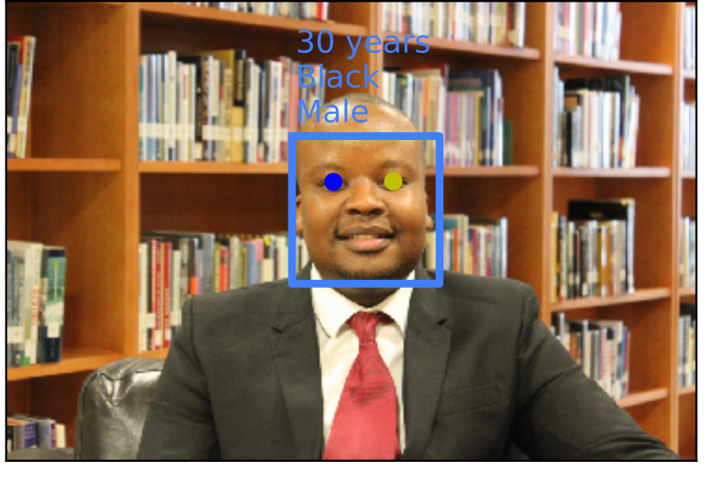

# PyFaceAnalysis
PyFaceAnalysis is a system that detects faces and analyzes them by estimating age, race, and gender. 
This software is based on an algorithm called *hierarchical information-preserving graph-based SFA* (HiGSFA). See the references for further details.

## What is PyFaceAnalysis for, and who should use it?
PyFaceAnalysis has been created to explore the feasibility of constructing hierarchical networks for supervised learning based on the *Slow Feature Analysis* (SFA) algorithm. It is mostly intended for evaluation purposes by researchers. 

## What types of images are supported?
The face detection system has been trained using mostly indoor images, where the faces are frontal. Still, a few faces with a small rotation angle w.r.t. the vertical axis can be found, and the maximum accepted in-plane angle is +/- 22.5 degrees.

The estimation of age, gender, and race has been trained using mug-shots, where the faces are frontal and the illumination is relatively homogeneous (no strong directional light sources). There is limited generalization to other image conditions.

The image formats that are supported are all of them that can be loaded by PIL (e.g., .jpg, .png).


## News
* **29.03.2018** PyFaceAnalysis now runs using the latest version of mdp (current master) and a recent version of the cuicuilco library (checkout 9bfd24201b0e4107b9689c13b2da55e3a01cfb55)

## Examples of analyzed faces 
 Image Copyright [Kingsley Huang](https://www.flickr.com/photos/flywithinsun/5946368231/) under the Creative Commons Atribution-NonCommercial 2.0 Generic license ([CC BY-NC 2.0](https://creativecommons.org/licenses/by-nc/2.0/)). Modifications: resizing, face detection, eye detection, and age, gender and race estimation.

 Image Copyright [IIP Campaigns & Initiatives](https://www.flickr.com/photos/iipcampaigns/17019075412/) under the Creative Commons Atribution-NonCommercial 2.0 Generic license ([CC BY-NC 2.0](https://creativecommons.org/licenses/by-nc/2.0/)). Modifications: resizing, face detection, eye detection, and age, gender and race estimation.

## Dependencies
PyFaceAnalysis requires the following libraries:
* [Modular Toolkit for Data Processing (MDP)](https://github.com/mdp-toolkit/mdp-toolkit) most recent version
* [cuicuilco](https://github.com/AlbertoEsc/cuicuilco) (version for checkout: 9bfd24201b0e4107b9689c13b2da55e3a01cfb55)
* MKL
* numexpr
* pygame

Besides a few standard libraries, including:
* numpy
* scipy
* pillow (PIL)
* lxml

## Usage
Basic execution:
  > python -u FaceDetectUpdated.py input_image.jpg output_file.txt

Make sure to set the parameter *smallest_face*, which controls the size of the smallest face that can be accepted by the detection algorithm, to achieve good speed and detection rate. 
  > python -u FaceDetectUpdated.py --smallest_face=0.1 sample_images/TNS-Group.jpg output.txt

The most convenient way to apply the algorithm to several images is to use *batch mode*. A batch file is a text file with the following structure:
```
image1.jpg
output1.txt
...
imageN.jpg
outputN.txt
```

Where each line is a filename that indicates the input image followed by another line that indicates the output filename (where the coordinates of the detected faces are stored).

Batch mode is much faster than the one-filename approach because the software modules are loaded only once. It is important not to add  any white line or space after the last entry. See the provided *sample_batchfile.txt* for an example of a batch file.
  > python -u FaceDetectUpdated.py --smallest_face=0.1 --batch=sample_batchfile.txt

## Author
PyFaceAnalysis has been developed by Alberto N. Escalante B. (alberto.escalante@ini.rub.de) as part of his PhD project at the Institute for Neural Computation, Ruhr-University Bochum, under the supervision of Prof. Dr. Laurenz Wiskott.

## References

* [Escalante-B, Wiskott, "How to Solve Classification and Regression Problems on High-Dimensional Data with a Supervised Extension of Slow Feature Analysis", Journal of Machine Learning Research 14 3683-3719, 2013](http://www.jmlr.org/papers/volume14/escalante13a/escalante13a.pdf)
* [Escalante-B, Wiskott, "Improved graph-based SFA: Information preservation complements the slowness principle", arXiv:1601.03945, 2016](https://arxiv.org/abs/1601.03945)


## Other information
The system is being continuously improving, make sure to use the latest version.

No new directories are created when storing the results, thus output directories should be created on beforehand by the user.

Bugs/suggestions/comments/questions: please write to alberto.escalante@ini.rub.de or use the appropriate github resources.
I will be glad to help you!

## LICENSE
Licensed under the Apache License, Version 2.0: [http://www.apache.org/licenses/LICENSE-2.0](http://www.apache.org/licenses/LICENSE-2.0)


